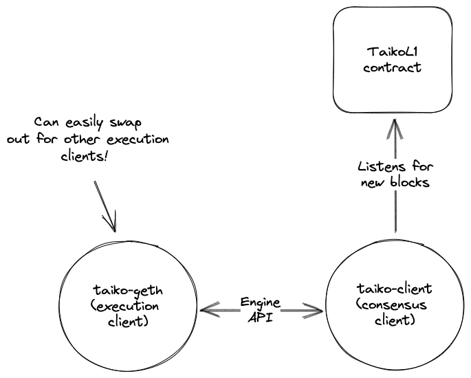

Taiko nodes are minimally modified Ethereum [execution clients](https://ethereum.org/en/glossary/#execution-client) that consist of two parts:

- [taiko-geth](https://github.com/taikoxyz/taiko-geth)
- [taiko-client](https://github.com/taikoxyz/taiko-client)

You can think of it like an Ethereum mainnet node, except replacing the consensus client with `taiko-client`. `taiko-client` then drives `taiko-geth` over the [Engine API](https://github.com/ethereum/execution-apis/tree/main/src/engine). This is a modular design that allows easily plugging in other execution clients.

## taiko-geth

The [taiko-geth](https://github.com/taikoxyz/taiko-geth) software is a fork of [go-ethereum](https://github.com/ethereum/go-ethereum) with some changes made according to the Taiko protocol.

Like Ethereum mainnet execution engines, `taiko-geth` listens to new L2 transactions broadcasted in the L2 network, executes them in the EVM, and holds the latest state and database of all current L2 data.

You can see all the changes made in the `taiko-geth` fork at [geth.taiko.xyz](https://geth.taiko.xyz)!

## taiko-client

The [taiko-client](https://github.com/taikoxyz/taiko-client) software replaces the consensus client piece of an Ethereum mainnet node. It connects to `taiko-geth`, and the compiled binary includes three sub-commands:

### `driver`

The `driver` serves as an L2 consensus client. It listens for new L2 blocks from the `TaikoL1` protocol contract, then directs the connected L2 execution engine to insert them or reorganize its local chain through the Engine API.

### `proposer`

The `proposer` fetches pending transactions from the L2 execution engine's mempool intervally pool, then tries to propose them to the `TaikoL1` protocol contract.

### `prover`

The `prover` requests validity proofs from the ZK-EVM and sends transactions to prove the proposed blocks are valid or invalid.

## Chain synchronization process

The Taiko protocol allows a block's timestamp to be equal to its parent
block's timestamp, which differs from the original Ethereum protocol. So it's
fine that there are two `TaikoL1.proposeBlock` transactions included in one L1
block.

Taiko client's driver informs the L2 execution engine about Taiko protocol contract's
latest verified L2 head and tries to let it catch up with the latest verified L2
block through P2P at first.

The driver monitors the execution engine's sync progress: If it's unable to make any new sync progress in a period of time, the driver switches to inserting the verified blocks into its local chain through the Engine API one by one.

After the L2 execution engine catches up with the latest verified L2 head, the driver subscribes to `TaikoL1.BlockProposed` events. When a new pending block is proposed, the driver:

1. Gets the corresponding `TaikoL1.proposeBlock` L1 transaction.
2. Decodes the `txList` and block metadata from the transaction's calldata.
3. Checks whether the `txList` is valid based on the rules defined in the Taiko protocol.

If the `txList` is **valid**, the driver:

1. Assembles a deterministic `TaikoL2.anchor` transaction based on the rules defined in the protocol and puts it as the first transaction in the proposed `txList`.
2. Uses this `txList` and the decoded block metadata to assemble a deterministic L2 block.
3. Directs the L2 execution engine to insert this assembled block and sets it as the current canonical chain's head via the Engine API.

If the `txList` is **invalid**, the driver:

1. Assembles an empty L2 block with only the anchor transaction.

## Process of proposing a block

To propose a block, the `proposer`:

1. Fetches the pending transactions from the L2 execution engine through the `txpool_content` RPC method.
2. If there are too many pending transactions in the L2 execution engine, splits them into several smaller `txLists`. This is because the Taiko protocol restricts the max size of each proposed `txList`.
3. Proposes all split `txLists` by sending `TaikoL1.proposeBlock` transactions.

## Process of proving a block

When a new block is proposed, the `prover`:

1. Gets the `TaikoL1.proposeBlock` L1 transaction calldata, decodes it, and validates the `txList`, just like what the `driver` software does.
2. Waits until the corresponding block is inserted by the L2 execution engine's `driver` software.
3. Generates a validity proof for that block asynchronously.

If the proposed block has a **valid** or **invalid** `txList`, the `prover`:

1. Generates a Merkle proof of the block's `TaikoL2.anchor` transaction to prove its existence in the `block.txRoot`'s [MPT](https://ethereum.org/en/developers/docs/data-structures-and-encoding/patricia-merkle-trie/) and this transaction receipt's [Merkle proof](https://rollup-glossary.vercel.app/other-terms#merkle-proofs) in the `block.receiptRoot`'s MPT from the L2 execution engine.
2. Submits the `TaikoL2.anchor` transaction's RLP encoded bytes, its receipt's RLP encoded bytes, the generated Merkle proofs, and a validity proof to prove this block **valid** by sending a `TaikoL1.proveBlock` transaction (the block is valid even for an invalid `txList` because we prove the invalid `txList` maps to an empty block with only the anchor transaction).
